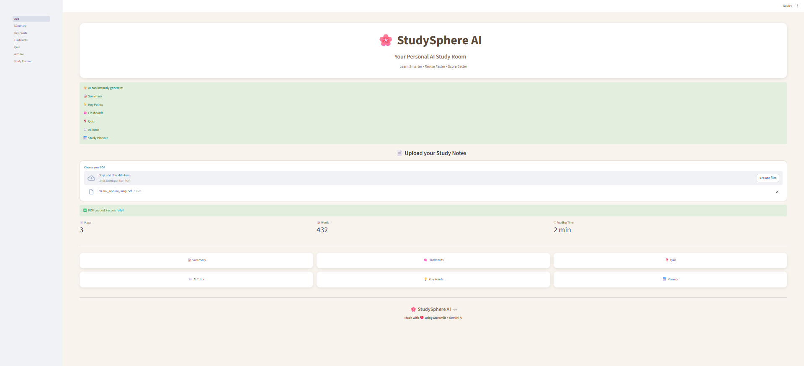
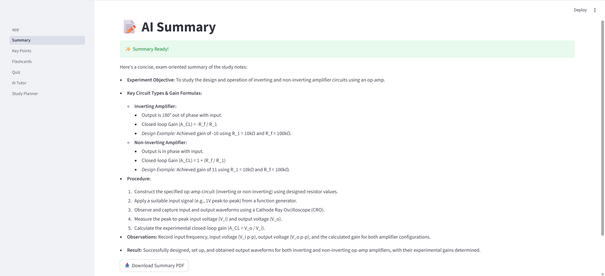
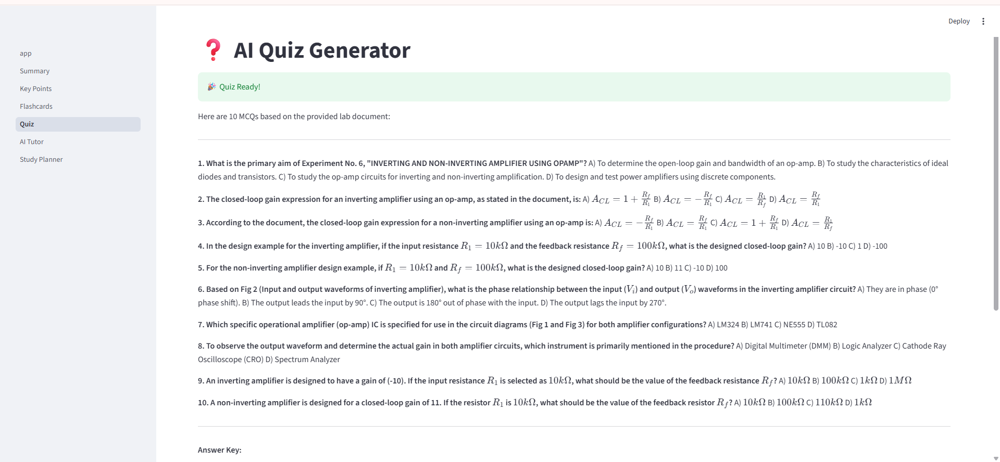
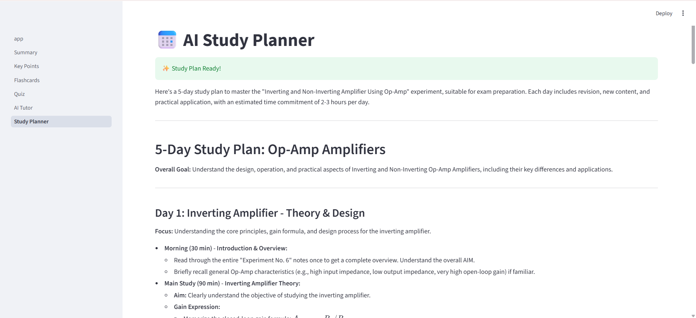

# 🌸 StudySphere AI

An AI-powered study assistant that transforms PDF notes into smart study materials using **Google Gemini AI**.

StudySphere AI helps students revise faster by automatically generating summaries, key points, flashcards, quizzes, and study plans from uploaded PDFs.

---

# ✨ Features

* 📄 Upload PDF study notes
* 📝 AI-generated Summary
* 💡 Key Points Extraction
* 🧠 Flashcards Generator
* ❓ AI Quiz Generator
* 💬 AI Tutor
* 📅 AI Study Planner
* 📥 Export AI Notes as PDF

---

# 🛠️ Tech Stack

* Python
* Streamlit
* Google Gemini API
* PyPDF
* FPDF
* python-dotenv

---

# 🚀 Installation

### Clone the repository

```bash
git clone https://github.com/zoyashaikh1211/StudySphere-AI.git
```

### Open the project

```bash
cd StudySphere-AI
```

### Install dependencies

```bash
pip install -r requirements.txt
```

### Create a `.env` file

```text
GEMINI_API_KEY=your_api_key_here
```

### Run the application

```bash
streamlit run app.py
```

---

# 📷 Screenshots

## 🏠 Home Page



---

## 📝 AI Summary



---

## ❓ Quiz Generator



---

## 📅 Study Planner



---

# 📂 Project Structure

```text
StudySphere AI/
│
├── app.py
├── README.md
├── requirements.txt
├── .env
│
├── pages/
│   ├── 1_Summary.py
│   ├── 2_Key_Points.py
│   ├── 3_Flashcards.py
│   ├── 4_Quiz.py
│   ├── 5_AI_Tutor.py
│   └── 6_Study_Planner.py
│
├── utils/
│   ├── gemini.py
│   └── pdf_export.py
│
└── assets/
    ├── home.png
    ├── summary.png
    ├── keypoints.png
    ├── flashcards.png
    ├── quiz.png
    └── planner.png
```

---

# 🎯 Future Improvements

* User authentication
* Multiple PDF support
* AI note explanation
* Progress tracking
* Cloud deployment

---

# ❤️ Built With

Made with **Python**, **Streamlit**, and **Google Gemini AI** to make studying smarter and more interactive.

---

## 👩‍💻 Author

**Zoya Shaikh**

If you liked this project, consider giving it a ⭐ on GitHub!
